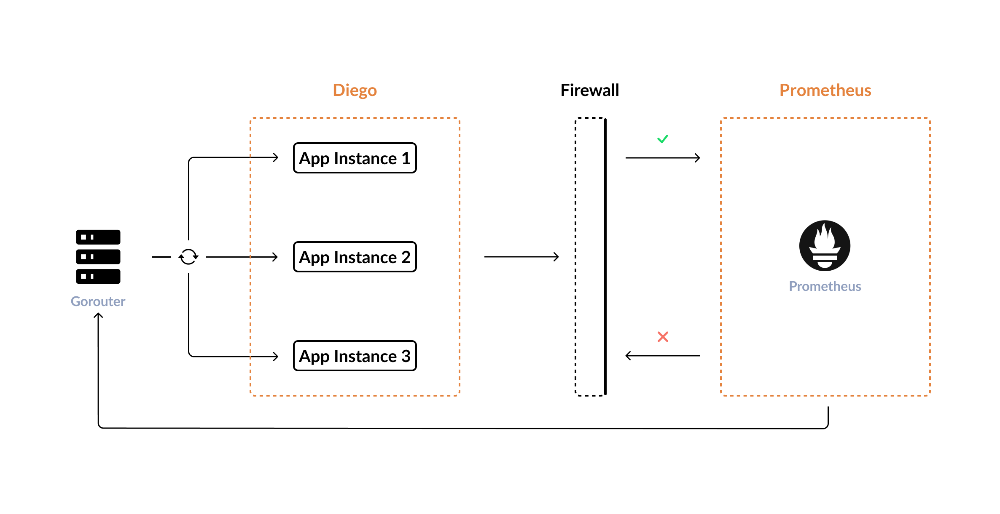
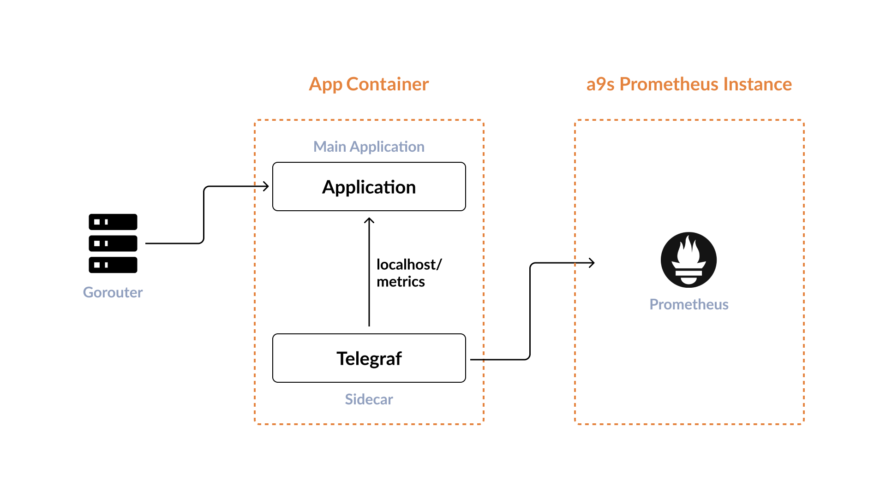
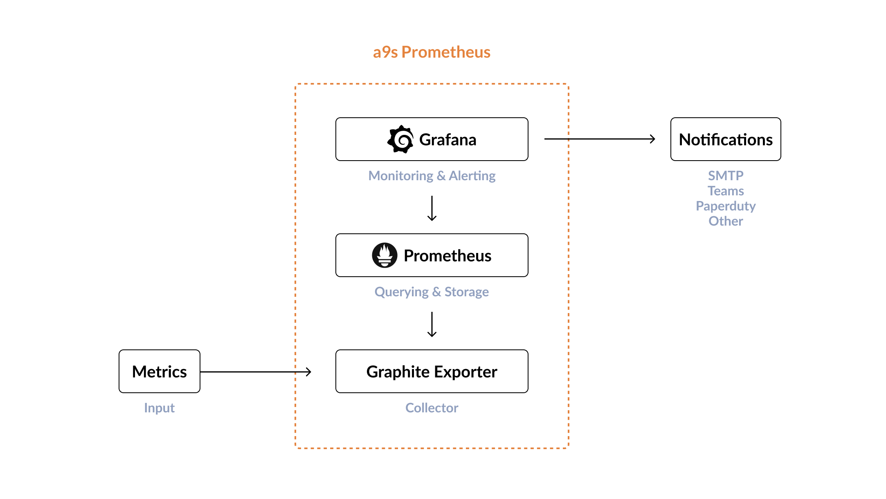
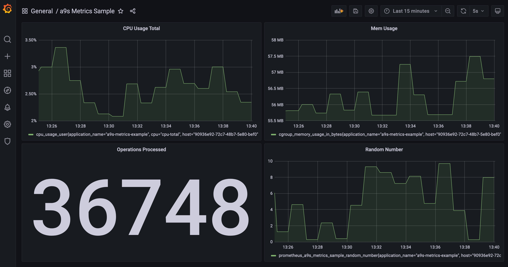

# a9s-metrics-example

This repository contains a sample application to demonstrate serving application
metrics via a sidecar buildpack in Cloud Foundry.

- [Introduction](#introduction)
- [The App](#the-app)
- [The Sidecar](#the-sidecar)
- [Prerequisites](#prerequisites)
- [Deploy a9s Prometheus](#deploy-a9s-prometheus)
- [Checkout the Sample Application](#checkout-the-sample-application)
- [The Application Manifest File](#the-application-manifest-file)
- [Push the App](#push-the-app)
- [Example Dashboard](#example-dashboard)

## Introduction

Retrieving application metrics is usually not difficult. Simply implement a
metrics endpoint and let [Prometheus](https://prometheus.io/), for example,
query that endpoint. If you deploy your application to a platform like Cloud
Foundry, you will eventually run into problems. Either the endpoint cannot be
easily retrieved from a running Prometheus instances to be scraped. Either the
endpoint is not reachable from the network where the Prometheus instance is
running or there are multiple instances of your application running and each
time Prometheus retrieves the application, you are redirected to a different
instance via the Gorouter as it acts like a load balancer.



Although Prometheus does not work this way, there is a way around it.
Instead of having Prometheus scrape the metrics endpoint, the metrics can be
sent to a [Graphite Exporter](https://github.com/prometheus/graphite_exporter)
endpoint, which is then scraped by Prometheus.

Assuming that a Prometheus service instance is deployed with a Graphite
Exporter, you only need a sidecar deployed in your application to stream the
metrics to the Graphite Exporter.

In this example, a simple application that provides a metrics endpoint is
deployed to Cloud Foundry. The sidecar is packaged in a buildpack and deployed
in parallel with the application via the application manifest.
The actual application is not changed in the process. Thus, the effort is
reduced to customizing the manifest. Only a few lines are added.



Let's take a look at what we have.

## The App

The application is written in [Go](https://go.dev/) and provides basic metrics
in addition to a static page via a separate metrics endpoint using this
[approach](https://prometheus.io/docs/guides/go-application/).

## The Sidecar

For the sidecar, this example uses the [telegraf-buildpack](https://github.com/tse-eche/telegraf-buildpack).
It includes [telegraf](https://www.influxdata.com/time-series-platform/telegraf/)
which is a plugin-driven server agent for collecting and sending metrics.
It is coupled to your application, scrapes the metrics endpoint, and forwards
them to a configured Graphite Exporter endpoint. Also, system metrics from your
application container are sent to the endpoint.

## Prerequisites

To deploy the application we need a platform and a Prometheus instance.
The Cloud Foundry installation we want to use is [a9s Public PaaS](https://paas.anynines.com/).
It offers us the necessary flexibility and we can deploy a Prometheus instance
here.

a9s Prometheus contains Prometheus, the Prometheus Alertmanager, a Graphite Endpoint,
and also a Grafana dashboard connected to Prometheus.



a9s Prometheus is not enabled in all accounts by
default, please ask our [support](support@anynines.com) to get a preview.

## Deploy a9s Prometheus

a9s Prometheus does not provide the ability to display application metrics by
default. This is because the Graphite Exporter has a mapping configuration that
transfers Graphite-compliant metrics into Prometheus metrics that are enriched
with tags. By default, the Graphite Exporter is set to strictly adhere to these
mappings and reject others. Therefore, one needs to adapt this configuration by
setting the `mapping_strict_match` property to `false` when creating a new
service instance or updating an existing one.

Creating a new service instance:

```bash
$ cf create-service a9s-prometheus promgraf2-single-small prometheus -c '{ "mapping_strict_match": false }'
```

Updating an existing one:

```bash
$ cf update-service prometheus -c '{ "mapping_strict_match": false }'
```

Before we can push the application, we have to wait until the service is deployed. We can use this command to query the status.

```bash
$ cf service prometheus
Showing info of service prometheus in org demonstrations / space demonstrations as phartz@anynines.com...

name:             prometheus
service:          a9s-prometheus
tags:
plan:             promgraf2-single-small
description:      This is a service creating and managing dedicated Prometheus to monitor applications and service instances, powered by the anynines Service Framework
documentation:    https://www.anynines.com
dashboard:        https://a9s-dashboard.de.a9s.eu/service-instances/8f866593-b6bc-4dac-9caf-902677d83b04
service broker:   a9s-prometheus

This service is not currently shared.

Showing status of last operation from service prometheus...

status:    create succeeded
message:
started:   2022-01-31T11:10:38Z
updated:   2022-01-31T11:12:50Z

Upgrades are not supported by this broker.
```

The status should be `create succeeded` like in the example above.

### Checkout the Sample Application

While waiting we can check out the application with `git clone` and have a look at the application manifest.

```bash
$ git clone https://github.com/anynines/a9s-metrics-example.git
```

Change into the directory.

```bash
$ cd a9s-metrics-example
```

## The Application Manifest File

The repository already contains the [manifest file](./manifest.yml).
There are three important parts.

1. In the `buildpacks` section, the `telegraf-buildpack` is already at the
   beginning of the list. Do not change the order, as this may cause a
   deployment error.
   `https://github.com/tse-eche/telegraf-buildpack.git`

2. The buildpack is designed to automatically use a bound a9s Prometheus instance. Therefore, you must define the service to bind in the `services` section. Cloud Foundry and the a9s Service Broker will then automatically take care of the necessary parameters to connect to the Prometheus instance.

3. If you use another Prometheus offering or the instance name in
   `VCAP_SERVICES` or your application differs from `a9s-prometheus` you have
   to set the env variables `GRAPHITE_HOST`and `GRAPHITE_PORT`

   ```yaml
   env:
     GRAPHITE_HOST: phd31bf28-prometheus-0.node.dc1.consul.dsf2
     GRAPHITE_PORT: 9109
   ```

## Push the App

When the service instance is ready, simply push the application with the
`cf push` command.

```bash
$ cf push
```

## Example Dashboard

When the application is pushed, we can open the Grafana dashboard in our
service instance and use the [example dashboard](./example/dashboard.json)
provided in the repository to see the metrics. Just copy the JSON data into a
new dashboard.



That's it.
